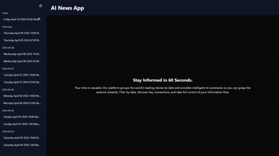

# 📰 AI News Summaries Platform

A full-stack application that automatically generates concise AI-powered news summaries twice a day and serves them through a REST API and a modern frontend interface.

---

## 🚀 Overview

This project collects news articles from multiple RSS feeds, processes them using an AI summarization model, and delivers structured summaries via a Laravel API and a Next.js frontend.

Summaries are generated **twice daily at 07:00 and 19:00**, ensuring fresh and up-to-date content for users.

---

## 📸 Demo

Below is a quick demo of the application in action:



---

## 🧠 AI Model

The system uses:

```
sshleifer/distilbart-cnn-12-6
```

A lightweight transformer model optimized for abstractive summarization.

---

## ⚙️ Backend (Laravel API)

The backend is responsible for:

* Storing generated summaries
* Serving API endpoints
* Running scheduled jobs
* Executing the Python summarization script

### 📡 API Endpoints

```
'/api/news'
'/api/news/latest'
'/api/news/by-date'
'/api/news/latest-by-date'
'/api/news/{id}'
```

### ⏰ Scheduling

Summaries are generated automatically using Laravel Scheduler:

* 🕖 07:00
* 🕖 19:00

---

## 🐍 Python Summarization Script

Located in:

```
backend/scripts/
```

### Responsibilities:

* Fetch news from RSS feeds
* Clean and structure content
* Generate a combined prompt
* Summarize using the AI model
* Output structured JSON

### Features:

* Multiple RSS sources (Google News, Tech, Business)
* Token-aware prompt building
* Clean text preprocessing
* Deterministic summarization (no sampling)

---

## 💻 Frontend (Next.js)

Built with:

* ⚡ Next.js
* 🎨 Tailwind CSS
* 🧩 shadcn/ui

### Features:

* 📰 News summaries list with pagination
* 📅 Filter summaries by date
* 📄 Individual summary detail page
* 📊 Sidebar with summaries grouped by last 7 days
* ⚡ Fast and responsive UI

---

## 🔄 How It Works

1. RSS feeds are fetched via Python script
2. Articles are cleaned and combined into a prompt
3. AI model generates a summary
4. Laravel stores the result
5. API exposes the summaries
6. Frontend fetches and displays them

---

## 📄 License

This project is open-source and available under the MIT License.

---

## 👨‍💻 Author

Built with ❤️ using AI + modern web technologies.
